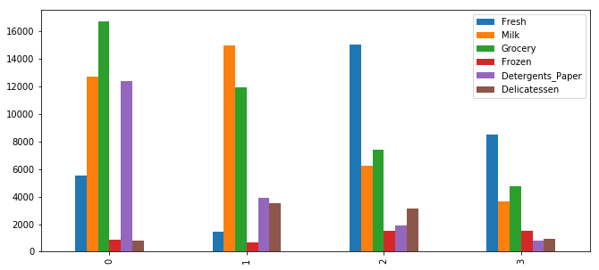

# Criando segmentos de clientes
------
Nesse projeto é analisado um conjunto de dados (fornecidos pela [Udacity](https://www.udacity.com/)) de compras anuais de diversos clientes, possuindo 440 registros com 6 variáveis "categóricas".

##### Bibliotecas
* numpy
* pandas
* sklearn
* seaborn
* matplotlib

##### Carregamento dos dados
```python
import numpy as np
import pandas as pd
from IPython.display import display # Permite o uso de display() para DataFrames

# Importe o código sumplementar para visualização de visuals.py
import visuals as vs

# Mostre matplotlib no corpo do texto (bem formatado no Notebook)
%matplotlib inline

# Carregue o conjunto de dados dos clientes da distribuidora de atacado
try:
    data = pd.read_csv("customers.csv")
    data.drop(['Region', 'Channel'], axis = 1, inplace = True)
    print("Wholesale customers dataset has {} samples with {} features each.".format(*data.shape))
except:
    print("Dataset could not be loaded. Is the dataset missing?")
```

## Explorando os dados
<p>Visualizando as colunas categóricas e volume das compras respectivas</p>

```python
# Mostre a descrição do conjunto de dados
display(data.describe())
```

<div>
<table border="1" class="dataframe">
  <thead>
    <tr style="text-align: right;">
      <th></th>
      <th>Fresh</th>
      <th>Milk</th>
      <th>Grocery</th>
      <th>Frozen</th>
      <th>Detergents_Paper</th>
      <th>Delicatessen</th>
    </tr>
  </thead>
  <tbody>
    <tr>
      <th>count</th>
      <td>440.000000</td>
      <td>440.000000</td>
      <td>440.000000</td>
      <td>440.000000</td>
      <td>440.000000</td>
      <td>440.000000</td>
    </tr>
    <tr>
      <th>mean</th>
      <td>12000.297727</td>
      <td>5796.265909</td>
      <td>7951.277273</td>
      <td>3071.931818</td>
      <td>2881.493182</td>
      <td>1524.870455</td>
    </tr>
    <tr>
      <th>std</th>
      <td>12647.328865</td>
      <td>7380.377175</td>
      <td>9503.162829</td>
      <td>4854.673333</td>
      <td>4767.854448</td>
      <td>2820.105937</td>
    </tr>
    <tr>
      <th>min</th>
      <td>3.000000</td>
      <td>55.000000</td>
      <td>3.000000</td>
      <td>25.000000</td>
      <td>3.000000</td>
      <td>3.000000</td>
    </tr>
    <tr>
      <th>25%</th>
      <td>3127.750000</td>
      <td>1533.000000</td>
      <td>2153.000000</td>
      <td>742.250000</td>
      <td>256.750000</td>
      <td>408.250000</td>
    </tr>
    <tr>
      <th>50%</th>
      <td>8504.000000</td>
      <td>3627.000000</td>
      <td>4755.500000</td>
      <td>1526.000000</td>
      <td>816.500000</td>
      <td>965.500000</td>
    </tr>
    <tr>
      <th>75%</th>
      <td>16933.750000</td>
      <td>7190.250000</td>
      <td>10655.750000</td>
      <td>3554.250000</td>
      <td>3922.000000</td>
      <td>1820.250000</td>
    </tr>
    <tr>
      <th>max</th>
      <td>112151.000000</td>
      <td>73498.000000</td>
      <td>92780.000000</td>
      <td>60869.000000</td>
      <td>40827.000000</td>
      <td>47943.000000</td>
    </tr>
  </tbody>
</table>
</div>

## Implementação: Selecionando Amostras
<p>Selecionando 3 amostras de clientes para usar como base na análise. Foi tentado selecionar 3 clientes com perfís aparentemente diferentes</p>


```python
# Selecione três índices de sua escolha que você gostaria de obter como amostra do conjunto de dados
indices = [209,315,373]

# Crie um DataFrame das amostras escolhidas
samples = pd.DataFrame(data.loc[indices], columns = data.keys()).reset_index(drop = True)
print ("Chosen samples of wholesale customers dataset:")
display(samples)
```

<div>
<table border="1" class="dataframe">
  <thead>
    <tr style="text-align: right;">
      <th></th>
      <th>Fresh</th>
      <th>Milk</th>
      <th>Grocery</th>
      <th>Frozen</th>
      <th>Detergents_Paper</th>
      <th>Delicatessen</th>
    </tr>
  </thead>
  <tbody>
    <tr>
      <th>0</th>
      <td>5550</td>
      <td>12729</td>
      <td>16767</td>
      <td>864</td>
      <td>12420</td>
      <td>797</td>
    </tr>
    <tr>
      <th>1</th>
      <td>1479</td>
      <td>14982</td>
      <td>11924</td>
      <td>662</td>
      <td>3891</td>
      <td>3508</td>
    </tr>
    <tr>
      <th>2</th>
      <td>15076</td>
      <td>6257</td>
      <td>7398</td>
      <td>1504</td>
      <td>1916</td>
      <td>3113</td>
    </tr>
  </tbody>
</table>
</div>

```python
samples.loc[3] = data.median()
samples.plot(kind='bar', figsize=[11,5])
samples.drop(axis=0, index=3, inplace=True)
```



### Questão 1
Considere que a compra total de cada categoria de produto e a descrição estatística do conjunto de dados abaixo para a sua amostra de clientes.

* Que tipo de estabelecimento (de cliente) cada uma das três amostras que você escolheu representa?

<b>Dica</b>: Exemplos de estabelecimentos incluem lugares como mercados, cafés e varejistas, entre outros. Evite utilizar nomes para esses padrões, como dizer "McDonalds" ao descrever uma amostra de cliente de restaurante.

<b>Resposta</b>

Ao comparar com o valor mediano do conjunto total, é possivel ver que cada amostra demonstra valores acima e outros abaixo dessa mediana.

- Por conta dos valores de <b>Grocery</b>, <b>Milk</b> e <b>Detergents_Paper</b>, acima da mediana:
  - 0 aparenta ser uma mercearia;
- <b>Fresh</b> abaixo da mediana, Milk e Grocery bem acima da mediana, mas demais valores equilibrados:
  - 1 aparenta ser uma padaria;
- <b>Fresh</b> bem acima da mediana e demais equilibrados:
  - 2 aparenta ser uma hortifruti.

### Implementação: Relevância do Atributo

Um pensamento interessante a se considerar é se um (ou mais) das seis categorias de produto são na verdade relevantes para entender a compra do cliente. Dito isso, é possível determinar se o cliente que comprou certa quantidade de uma categoria de produto vai necessariamente comprar outra quantidade proporcional de outra categoria de produtos? Nós podemos determinar facilmente ao treinar uma aprendizagem não supervisionada de regressão em um conjunto de dados com um atributo removido e então pontuar quão bem o modelo pode prever o atributo removido.

No bloco de código abaixo, você precisará implementar o seguinte:

- Atribuir *new_data* a uma cópia dos dados ao remover o atributo da sua escolha utilizando a função DataFrame.drop
- Utilizar *sklearn.cross_validation.train_test_split* para dividir o conjunto de dados em conjuntos de treinamento e teste.
    - Utilizar o atributo removido como seu rótulo alvo. Estabelecer um *test_size* de 0.25 e estebeleça um *random_state*.
- Importar uma árvore de decisão regressora, estabelecer um *random_state* e ajustar o aprendiz nos dados de treinamento.
- Reportar a pontuação da previsão do conjunto de teste utilizando a função regressora score.

```python
# Fazer uma cópia do DataFrame utilizando a função 'drop' para soltar o atributo dado
atributo = 'Grocery'
new_data = data.drop(columns=atributo)

# Dividir os dados em conjuntos de treinamento e teste utilizando o atributo dado como o alvo
from sklearn.cross_validation import train_test_split
from sklearn.tree import DecisionTreeRegressor

X_train, X_test, y_train, y_test = train_test_split(new_data, data[atributo], test_size=.3, random_state=13)

# Criar um árvore de decisão regressora e ajustá-la ao conjunto de treinamento
regressor = DecisionTreeRegressor().fit(X_train, y_train)

# Reportar a pontuação da previsão utilizando o conjunto de teste
score = regressor.score(X_test, y_test)

print(score)
```
0.6958448655361026

### Questão 2
- Qual atributo você tentou prever?
- Qual foi a pontuação da previsão reportada?
- Esse atributo é necessário para identificar os hábitos de compra dos clientes?

<b>Dica:</b> O coeficiente de determinação, *R^2*, é pontuado entre 0 e 1, sendo 1 o ajuste perfeito. Um *R^2* negativo indica que o modelo falhou em ajustar os dados. Se você obter um score baixo para um atributo em particular, isso nos faz acreditar que aquele ponto de atributo é difícil de ser previsto utilizando outros atributos, sendo assim um atributo importante quando considerarmos a relevância.

<b>Resposta:</b> Tentei prever o Grocery, resultando em 0.69 aproximadamente. Entendo que não é muito necessário para prever os hábitos de compra.
